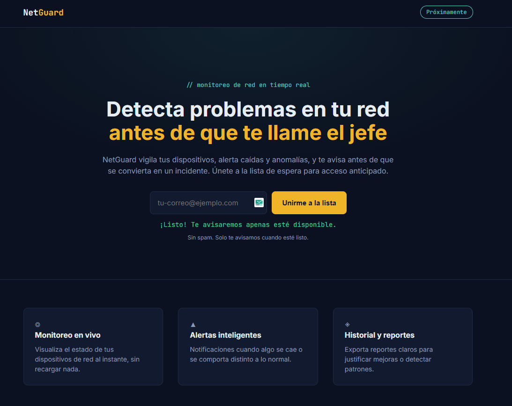

# NetGuard — Landing Page con Formulario Funcional

## 📌 Descripción

Landing page de waitlist para "NetGuard" (producto ficticio de monitoreo de red), con un formulario que guarda correos reales en una base de datos Firebase Firestore. Proyecto educativo enfocado en aprender a conectar un frontend simple con un backend real (sin servidor propio).

## 🖥️ Demo



## 🛠️ Tecnologías

- HTML / CSS / JavaScript puro (ES Modules)
- Firebase Firestore (base de datos en la nube, capa gratuita)

## ⚠️ Configuración obligatoria antes de usarlo

Este proyecto **no va a guardar ningún correo** hasta que conectes tu propio proyecto de Firebase. Sigue estos pasos:

### 1. Crear un proyecto en Firebase

1. Entra a [console.firebase.google.com](https://console.firebase.google.com)
2. Click en **"Agregar proyecto"**, ponle un nombre (ej: `netguard-landing`) y sigue el asistente (puedes desactivar Google Analytics, no es necesario)

### 2. Crear la base de datos Firestore

1. En el menú lateral, entra a **Build → Firestore Database**
2. Click en **"Crear base de datos"**
3. Selecciona **"Iniciar en modo de prueba"** (permite lectura/escritura por 30 días, suficiente para este proyecto educativo)
4. Elige la ubicación del servidor más cercana a ti

### 3. Registrar una app web dentro del proyecto

1. En la página principal del proyecto, click en el ícono **`</>`** (Web)
2. Ponle un apodo a la app (ej: `netguard-web`) — no hace falta configurar hosting
3. Firebase te va a mostrar un bloque de código con tu configuración (`firebaseConfig`)

### 4. Copiar tu configuración al proyecto

Abre el archivo `firebase-config.js` de este repositorio y reemplaza los valores de ejemplo con los tuyos:

```js
const firebaseConfig = {
  apiKey: "TU_API_KEY",
  authDomain: "TU_PROYECTO.firebaseapp.com",
  projectId: "TU_PROYECTO",
  storageBucket: "TU_PROYECTO.appspot.com",
  messagingSenderId: "TU_SENDER_ID",
  appId: "TU_APP_ID",
};
```

Estos datos **no son secretos sensibles** (Firebase los expone públicamente en el navegador por diseño), pero igual es buena práctica no compartir el proyecto de Firebase real si decides usarlo para algo más que este ejercicio.

### 5. Abrir el proyecto

Como este proyecto usa ES Modules (`import`/`export`), no puedes abrir `index.html` con doble clic — los navegadores bloquean los módulos si se abren como archivo local (`file://`). Necesitas un servidor local simple:

**Opción A — Con la extensión "Live Server" de VS Code:**
Click derecho sobre `index.html` → "Open with Live Server"

**Opción B — Con Python (si lo tienes instalado):**
```bash
python3 -m http.server 8080
```
Y abre `http://localhost:8080` en tu navegador.

## ⚙️ Cómo funciona

1. El usuario escribe su correo y presiona "Unirme a la lista"
2. `script.js` toma ese valor y lo envía a Firestore mediante `addDoc`, guardándolo en una colección llamada `waitlist` junto con la fecha de registro (`serverTimestamp`)
3. Se muestra un mensaje de confirmación o de error según el resultado
4. Puedes ver los correos guardados entrando a **Firebase Console → Firestore Database → colección "waitlist"**

## 📚 Qué aprendí

- Cómo conectar un formulario HTML simple a una base de datos en la nube sin necesidad de programar un backend propio
- La diferencia entre guardar datos en el navegador (que se pierden al cerrar la pestaña) y guardarlos de forma persistente en un servicio como Firestore
- Cómo funcionan los ES Modules en JavaScript (`import`/`export`) y por qué requieren un servidor local para funcionar, a diferencia de un script tradicional
- Manejo de estados de un formulario (enviando, éxito, error) para dar retroalimentación clara al usuario

## ⚠️ Nota de seguridad

El modo de prueba de Firestore permite lectura y escritura pública durante 30 días — es adecuado para aprender, pero **no para producción**. Un proyecto real necesitaría reglas de seguridad (Firestore Security Rules) que validen quién puede escribir y qué datos.

## 📄 Licencia

Este proyecto es solo con fines educativos. NetGuard es un producto ficticio creado únicamente para practicar la integración de formularios con Firebase.
